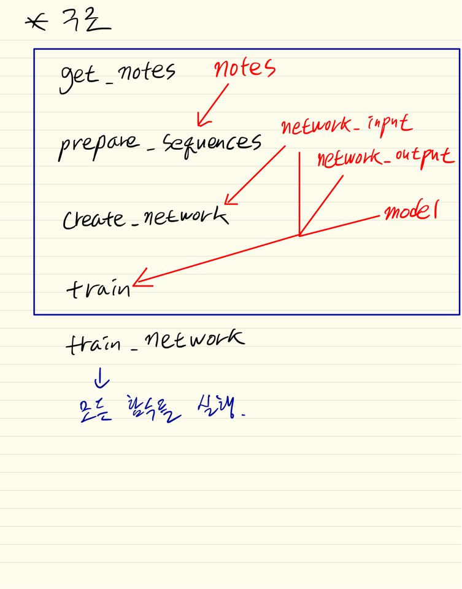
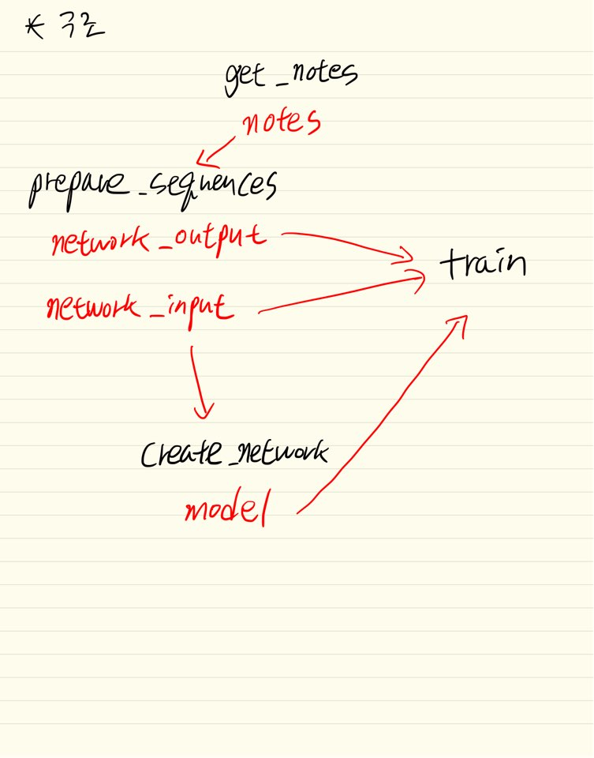

# train 안내문
[music21 공식 문서](http://web.mit.edu/music21/doc/index.html)  
[music21 공식 문서 - Module Reference](http://web.mit.edu/music21/doc/moduleReference/index.html)
### 주석은 각 모듈별 .py에 있음

## music21 사용할 때
예시 코드에는 나와있지 않지만 matplotlib를 사용하고 있어 설치 해야함.
```
pip install matplotlib
```

## 함수 설명
### get_notes()
@param X  
@return notes  

-------------
.mid 파일을 streamObj로 load하고 note와 chord로 변환한다.
### prepare_sequences()
@param_1 notes  
@param_2 n_vocab  
@return (network_input, network_output)  

---------------------------------------
notes = note, chord 배열  
n_vocab = len(set(notes)) - note 집합 길이  
### create_network()
@param_1 network_input  
@param_2 n_vocab  
@return model  

-------------------------
### train()
@param_1 model  
@param_2 network_input  
@param_2 network_output  
@return X  

----------------------
### train_network()
@param_1 X  
@return X  

---------------------

### 함수 구조
#### 함수 개관

#### 함수 연계


## show() 함수를 사용할 때 경로가 틀렸다고 나올 때 해결 방법
```
[WinError 123] 파일 이름, 디렉터리 이름 또는 볼륨 레이블 구문이 잘못되었습니다:
'C:\Dev\workspace\Myproject\ML_music\src\train\C:\Program Files\MuseScore 3.5\MuseScore3.exe'
```
형식의 에러가 발생할 때
```python
us = environment.UserSettings()
us['musescoreDirectPNGPath'] = 'C:/Program Files/MuseScore 3/bin/MuseScore3.exe'
```
방식으로 해결할 수 있다.

경로를 보면 'MuseScore3.exe'를 찾는 경로인데 해당 경로에 파일이 없을 뿐더러 MuseScore에서 이름 자체를 변경하여
MuseScore 3.5 경로 자체가 존재하지 않고 MuseScore 3/bin/MuseScore3으로 설정해줘야 한다.

그래서 직접 lib path를 변경해서 수정할 수도 있지만

music21에서는 music21.environment로 현재 사용자의 설정의 수정할 수 있도록 기능을 제공하고 있기 때문에 해당 기능을 사용하여
환경 설정을 변경하였다.